<p align="center">
  
</p>

<h1></h1>
<p align="center">

  
  
   
  
  
  
</p>


<b>PyPad</b> - is a code editor for different programming languages. 
PyPad supports some languages like a Python, Json, Html and CSS. So far, PyPad is in development and it is not suitable for use, but you can watch the demo version of the project and  <a href="https://github.com/chebupelka8/PyPad-v2/releases/tag/v0.2.2">test it</a>.

```java
// these are just test hotkeys, they will change in the future.

Ctrl+O - Open directory
Ctrl+P - Open file
Ctrl+, - Open settings
Ctrl+T - Open theme picker
Ctrl+B - Hide/Show file tree
Ctrl+Tab - Switch current file
```

<p align="center">
  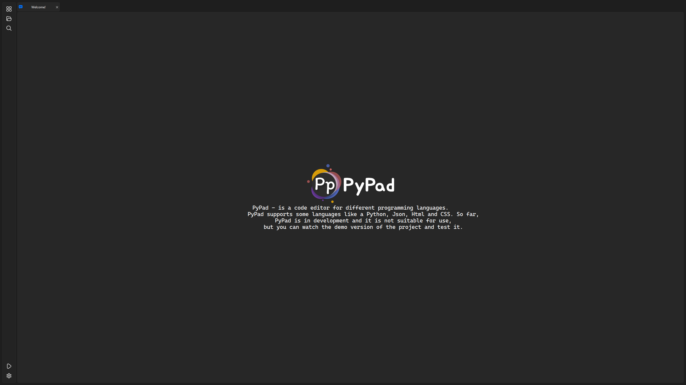
  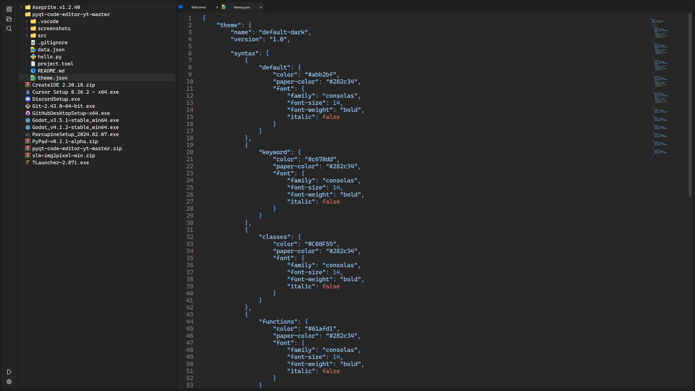
  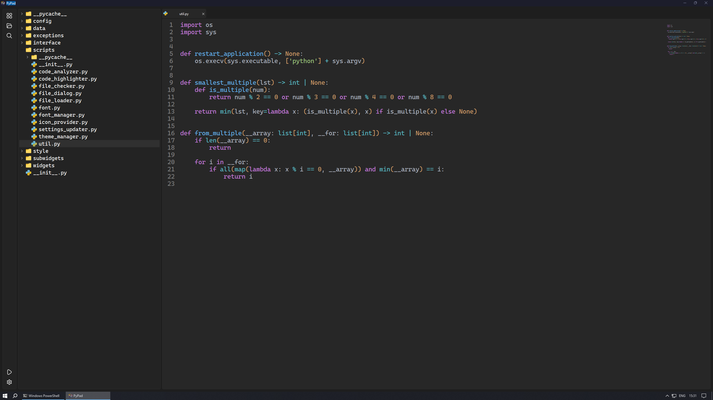
  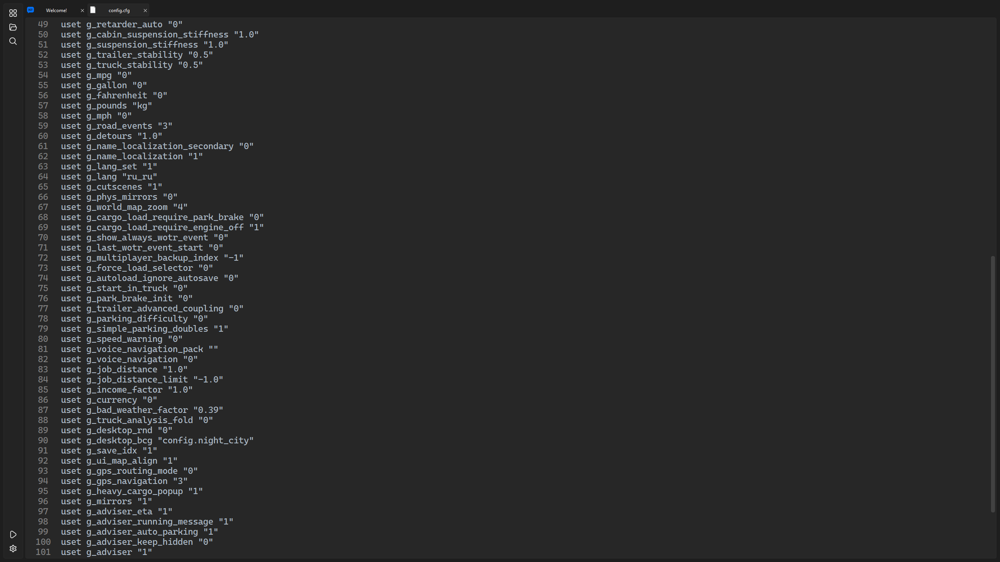
  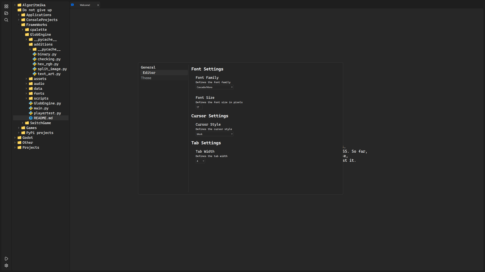
  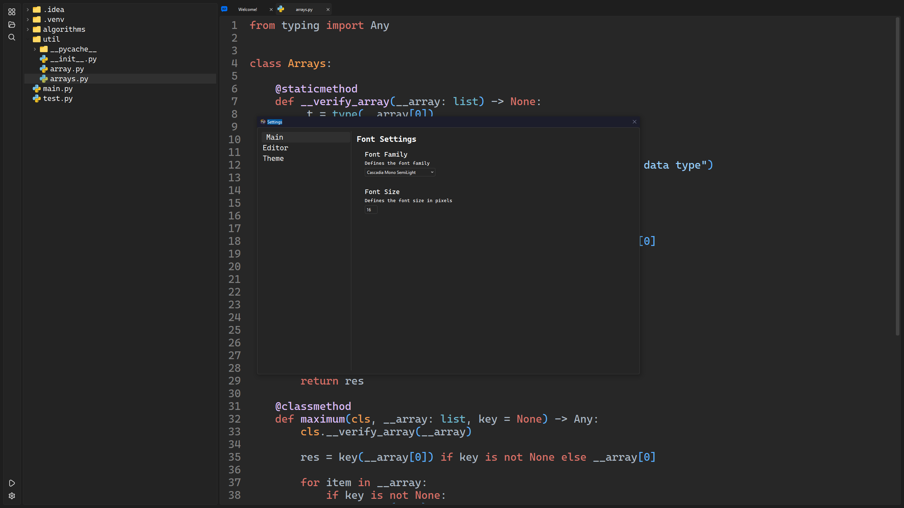
  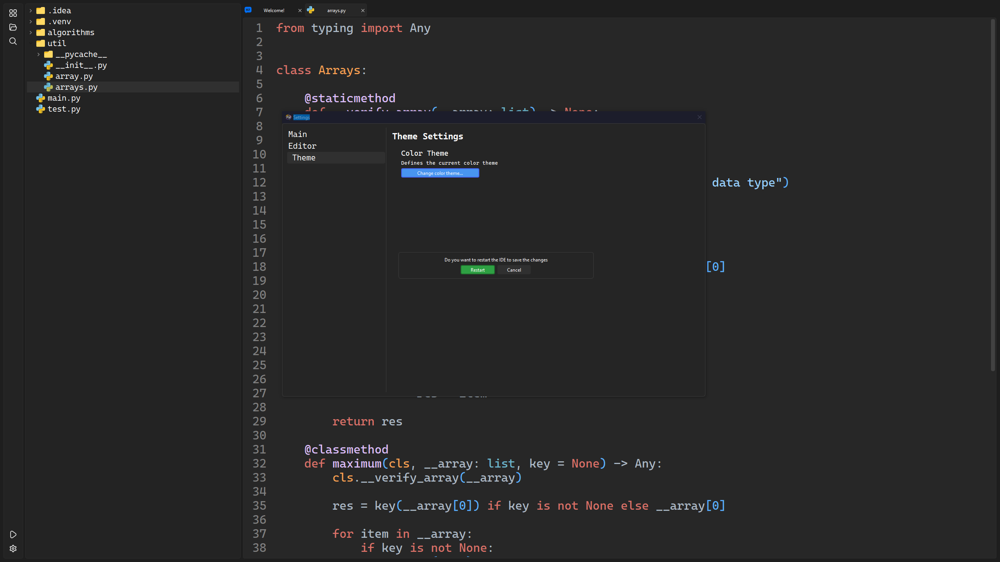
  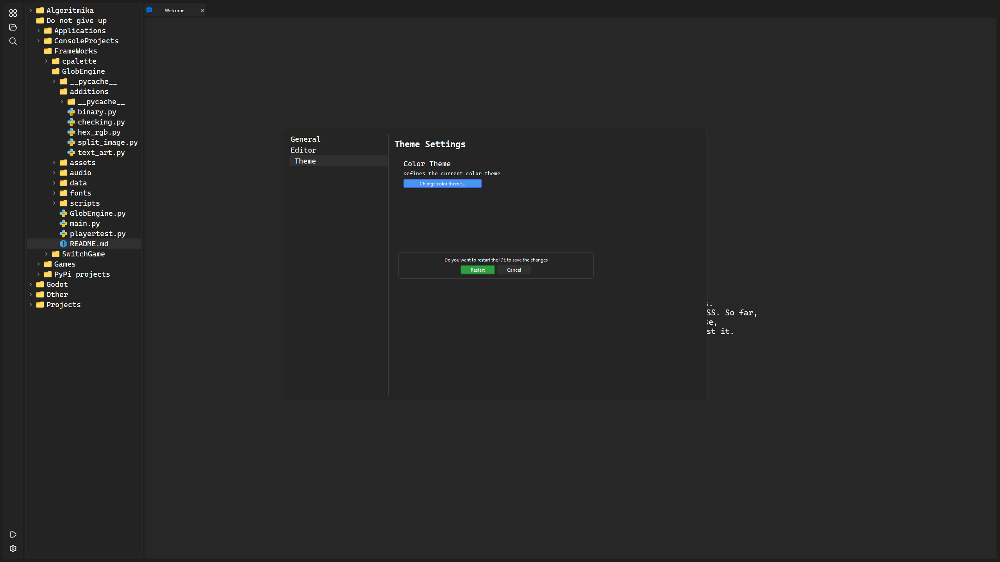
  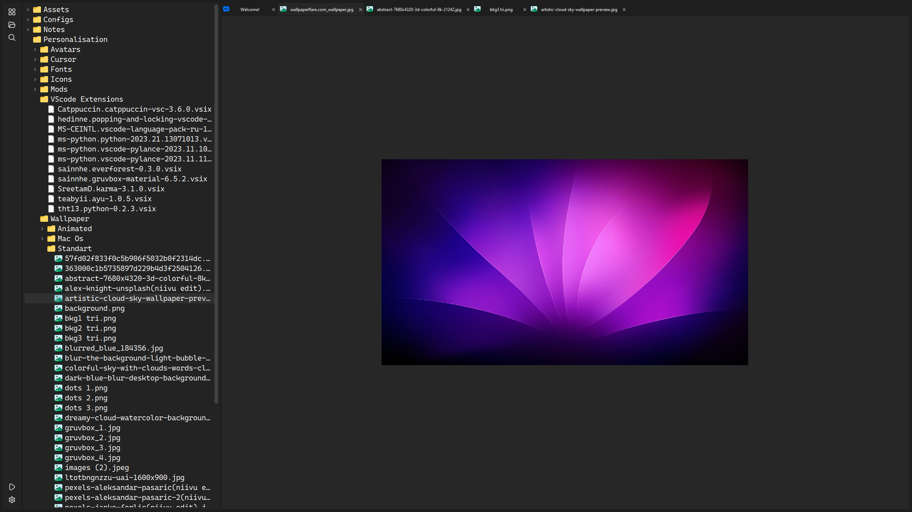
  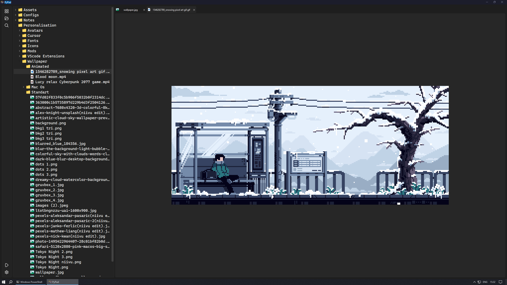
  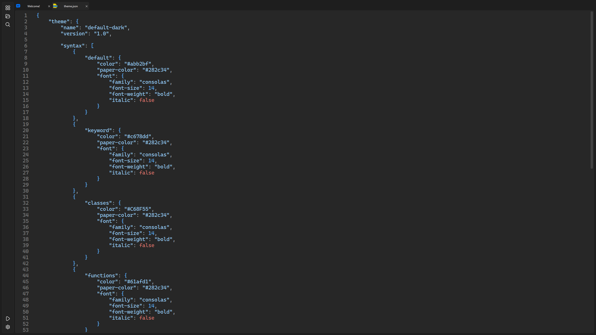
  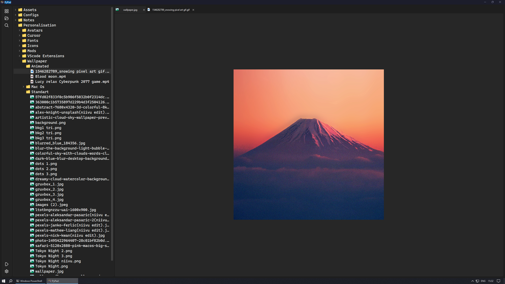
  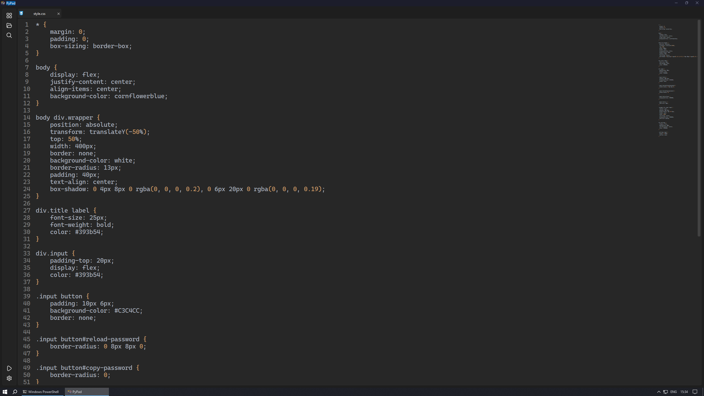
  
</p>
